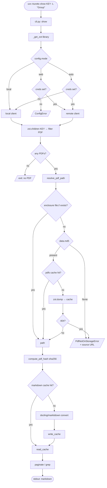

# Zotero Web API Mode

## Summary

Allow riszotto to operate fully against the Zotero Web API without a running local Zotero desktop. Adds a `mode = "auto" | "local" | "web"` configuration knob (with env-var support via pydantic-settings), removes the hardcoded local-only branch for the personal library in `_get_zot()`, and teaches the `show` command to download attachment PDFs over the web API into a new on-disk cache layer.

The change is read-only: it does not introduce any write operations against Zotero.

## Motivation

Today the local Zotero desktop must run on port 23119 for any riszotto command to work against the personal library. Group libraries already fall back to the web API when local is unreachable, but the personal library is hardcoded to `local=True` in `client.py: get_client()`, and `show` always fails over the web API because `get_pdf_path()` only resolves `file://` enclosures.

This blocks two real workflows:

1. Headless / remote environments where the Zotero desktop is not installed (CI, servers, containers, secondary machines).
2. Reading group-library PDFs that are only synced to Zotero storage and not present locally.

## Design Decisions

| Decision | Choice | Rationale |
|----------|--------|-----------|
| Mode selector | `mode = "auto" \| "local" \| "web"` | Three explicit states; `auto` = current behavior with creds → web fallback for personal too |
| Default mode | `auto` | Backward compatible: behaves like today when creds absent; opts into web seamlessly when creds added |
| Config loader | `pydantic-settings` | Replaces hand-rolled `tomllib` + `os.environ` in `config.py`; consistent precedence rules; field validation |
| Personal library client selection | Same rule as group libraries (mode-driven) | Collapses two code paths into one; removes the `library is None` special case in `_get_zot()` |
| PDF cache key | `attachment.data.md5` from Zotero metadata | Empirically present iff file is on Zotero storage (1:1 with downloadability); content-addressed; no need to hash twice |
| PDF cache layout | `cache_dir/pdfs/{md5}.pdf` | md5 is a content hash, so it's globally unique. Two attachments with the same PDF (same paper across libraries) deduplicate naturally |
| md5 absent handling | Hard error with source URL | md5 is `None` iff the file is not on Zotero storage and download will 404; no useful fallback at the API level |
| Markdown cache | Untouched | Existing sha256-keyed `converter/cache.py` already handles content-addressing post-download |
| Out of scope | URL-based fallback (publisher scraping) | Different concern (auth, paywalls, robots policy); deferred |
| Out of scope | LRU/size cap on PDF cache | Manual `cache clear` extension is enough until size becomes a real problem |

## Configuration

### File: `~/.riszotto/config.toml`

```toml
[zotero]
api_key = "ABC123XYZ789"   # from zotero.org/settings/keys
user_id = "123456"          # numeric user ID
mode = "auto"               # "auto" | "local" | "web", default "auto"
```

All three fields are optional.

### Environment variables

All env vars use the `RISZOTTO_` prefix via pydantic-settings `env_prefix = "RISZOTTO_"`, with nested delimiter `__` so the `[zotero]` table maps to `RISZOTTO_ZOTERO_*`.

| Config key | Env var | Notes |
|-----------|---------|-------|
| `zotero.api_key` | `RISZOTTO_ZOTERO_API_KEY` | Renamed from `ZOTERO_API_KEY` (breaking) |
| `zotero.user_id` | `RISZOTTO_ZOTERO_USER_ID` | Renamed from `ZOTERO_USER_ID` (breaking) |
| `zotero.mode` | `RISZOTTO_ZOTERO_MODE` | New. Values validated against the `Literal` type |

Source precedence (lowest to highest): defaults → TOML → env vars. Implemented via `pydantic-settings` `BaseSettings` with `env_nested_delimiter="__"`.

### Mode resolution

| `mode` | creds present? | Result |
|--------|----------------|--------|
| `auto` (default) | yes | web client |
| `auto` | no | local client |
| `local` | — | local client (errors if Zotero not running) |
| `web` | yes | web client |
| `web` | no | `ConfigError` at startup |

Applies uniformly to the personal library and group libraries. The current `library is None → always local` branch in `_get_zot()` is removed.

## Architecture

Three coordinated changes, each isolated to one concern:

1. **`src/riszotto/config.py`** — replace dataclass + `tomllib` + manual env handling with a pydantic-settings `Settings` class. Add `mode` field. Public API (`load_config()`, `Config`) preserved for callers in `client.py` and `cli.py` — only the internals change.

2. **`src/riszotto/client.py`** — refactor `get_client()`:
   - Single rule: client construction is driven by `config.mode` + creds presence (see Mode resolution table). Same rule applies to personal and group libraries.
   - Drop the `library is None → local=True` early return.
   - Group lookup uses the mode-resolved client only — no implicit local→web fallback. (In `mode="auto"` with creds, the resolved client is already web, so groups not found locally are still found.)
   - Add `resolve_pdf_path(zot, attachment) -> Path` (new public function). Replaces direct calls to `get_pdf_path()` in `cli.py:670`. Encapsulates: try local enclosure → check raw-PDF cache → download via `zot.dump()`.

3. **`src/riszotto/paths.py` + new module `src/riszotto/pdf_cache.py`** — add `PDF_CACHE_DIR = cache_dir() / "pdfs"`. New module exposes:
   - `pdf_cache_path(md5) -> Path` — returns `PDF_CACHE_DIR / f"{md5}.pdf"`
   - `read_pdf_cache(md5) -> Path | None`
   - `download_to_pdf_cache(zot, attachment) -> Path` (calls `zot.dump()` writing to `pdf_cache_path(attachment["data"]["md5"])`)
   - `clear_pdf_cache() -> int` and `pdf_cache_stats() -> dict` to integrate with the existing `cache show` / `cache clear` CLI subcommands.

## Data Flow: `show` Command



Three concrete walkthroughs:

1. **Cold cache, synced group PDF.** `auto` + creds → remote → md5 present → PDF cache miss → `zot.dump()` downloads → sha256 → markdown cache miss → docling converts → write both caches → output. Total: download + convert.
2. **Warm cache, same paper.** Same path until raw-PDF cache → **hit** (no network) → sha256 → markdown cache **hit** → output. Total: ms, fully offline.
3. **Personal library, md5 null (current empirical case).** `auto` + creds → remote → md5 is `None` → `PdfNotOnStorageError` with source URL. User switches to `mode = "local"` and retries → local file path resolves → existing flow.

## Cache Layout

```
${cache_dir}/
├── conversions/                         # existing markdown cache (unchanged)
│   └── {zotero_key}/
│       └── {sha256_first12}/
│           ├── content.md
│           ├── meta.json
│           └── *.png
└── pdfs/                                # NEW
    └── {md5}.pdf
```

PDF cache invalidation is implicit: `md5` is the file's content hash, so any change in the underlying file produces a different cache filename. The same paper present in multiple libraries deduplicates to a single cache entry. Stale entries linger until manually cleared — acceptable while corpus is small.

## Error Handling

| Trigger | Error class | User-facing message |
|---------|-------------|---------------------|
| `mode="web"` + missing creds | `ConfigError` (existing) | "Web mode requires `api_key` and `user_id`. Configure in `~/.riszotto/config.toml [zotero]` or set `RISZOTTO_ZOTERO_API_KEY` and `RISZOTTO_ZOTERO_USER_ID`." |
| `mode="local"` + Zotero not running | Existing connection error | Unchanged ("Start Zotero or configure api_key…") |
| `mode="auto"` + neither | Existing | Unchanged |
| Remote attachment with `md5=None` | `PdfNotOnStorageError` (new) | "PDF for {key} is not on Zotero storage (file sync disabled or metadata-only attachment). Source URL: {data.url}. Run riszotto in local mode, or enable file sync in Zotero preferences." |
| `zot.file()` 404 despite md5 present (rare; quota / deletion) | `PdfNotOnStorageError` | Same |
| `zot.file()` 403 | `PermissionError` (new, riszotto-specific) | "API key lacks file-read permission for this library. Update key permissions at zotero.org/settings/keys." |
| `zot.file()` other HTTP error | Wrapped in `ClientError` (existing pattern) | Surface status + URL |

`PdfNotOnStorageError` and the new `PermissionError` live in `src/riszotto/client.py` next to the existing `LibraryNotFoundError` / `AmbiguousLibraryError`.

## CLI Surface

No new commands. `cache show` and `cache clear` extend to cover the new `pdfs/` directory:

- `cache show` reports both conversion and PDF cache sizes/counts.
- `cache clear` (with no flags) clears both. New `--only conversions|pdfs` flag for selective clearing. `--key KEY` continues to scope to a single Zotero key — but only the markdown cache is key-scoped, since the PDF cache is content-keyed (md5) and not associated with any specific Zotero key. This is documented in `cache clear --help`.

The `show` command itself takes no new flags. Mode is config-only.

## Testing

| Layer | Tests |
|-------|-------|
| `config.py` | Pydantic-settings precedence: defaults → TOML → `RISZOTTO_ZOTERO_*` env vars. Invalid `mode` value rejected. Existing TOML without `mode` parses fine (defaults to `"auto"`). Old `ZOTERO_API_KEY` / `ZOTERO_USER_ID` env vars are *not* read (breaking change, see Migration). |
| `client.py: _get_zot()` | Matrix of `mode` × creds-present × `library` (None / group). Mocks `pyzotero.Zotero` constructor; asserts `library_id`/`library_type`/`api_key`/`local` flags on the returned client. |
| `client.py: resolve_pdf_path()` | (a) local enclosure exists → returns it. (b) local enclosure missing + md5 present + PDF cache hit → returns cache path, `zot.dump` not called. (c) Same + cache miss → `zot.dump` called once, returns new path. (d) md5 None → raises `PdfNotOnStorageError` with `source_url` set. (e) `zot.dump` raises 404 → raises `PdfNotOnStorageError`. (f) `zot.dump` raises 403 → raises `PermissionError`. |
| `pdf_cache.py` | Path construction; cache hit/miss; `clear_pdf_cache(key=...)` removes only matching files. |
| `cli.py: show` | End-to-end with mocked `zot` returning a synced attachment. Verifies new error paths surface cleanly to the user. |
| Integration (opt-in) | Gated on `RISZOTTO_TEST_API_KEY` env var. Hits a known small public group; verifies real download + cache behavior. Skipped in CI by default. |
| Existing tests | All current tests must stay green. `converter/cache.py` is untouched. |

## Migration / Backward Compatibility

- **No `[zotero]` section configured:** behavior identical to today. `mode="auto"` + no creds → local-only.
- **Creds configured, no `mode` field:** defaults to `mode="auto"`. **Behavior change:** the personal library now uses the web API instead of falling back to local. Documented in `CHANGELOG.md` and the README.
- **Env var rename (breaking):** `ZOTERO_API_KEY` → `RISZOTTO_ZOTERO_API_KEY`, `ZOTERO_USER_ID` → `RISZOTTO_ZOTERO_USER_ID`. Old names are no longer read. Documented in `CHANGELOG.md` and the README. Migration is one-line shell change for affected users; TOML config is unchanged.
- **Old "personal=local, groups=web-fallback" hybrid is removed.** Users who specifically want the personal library to stay local while groups use the web API have two options:
  - Leave `mode="auto"` and run Zotero locally — `auto` picks local when no creds reach it; if creds *are* set, web takes over uniformly (the new behavior).
  - Set `mode="local"` to force local everywhere; group lookups will then fail when the group is not synced locally, which matches the pre-groups-feature state.
  
  The collapsed rule is strictly simpler and the new default (`auto` + creds → web everywhere) is strictly more capable than the old hybrid for users with file sync enabled.

## Risks

- **Personal-library `show` will fail loudly for users without Zotero file sync.** Most painful for the `mode="auto"` default + creds-present case. Mitigation: error message points at both fixes (local mode, or enable Zotero file sync).
- **Bandwidth surprise on first show.** A 30 MB PDF download from a slow connection is noticeable. Mitigation: log the download size and progress (one-line stderr message before `zot.dump`).
- **Cache disk growth.** No automatic eviction. Mitigation: `cache show` exposes size; `cache clear` is one command away.
- **pydantic-settings adds a dep.** Already pulling pydantic. Marginal install cost.
